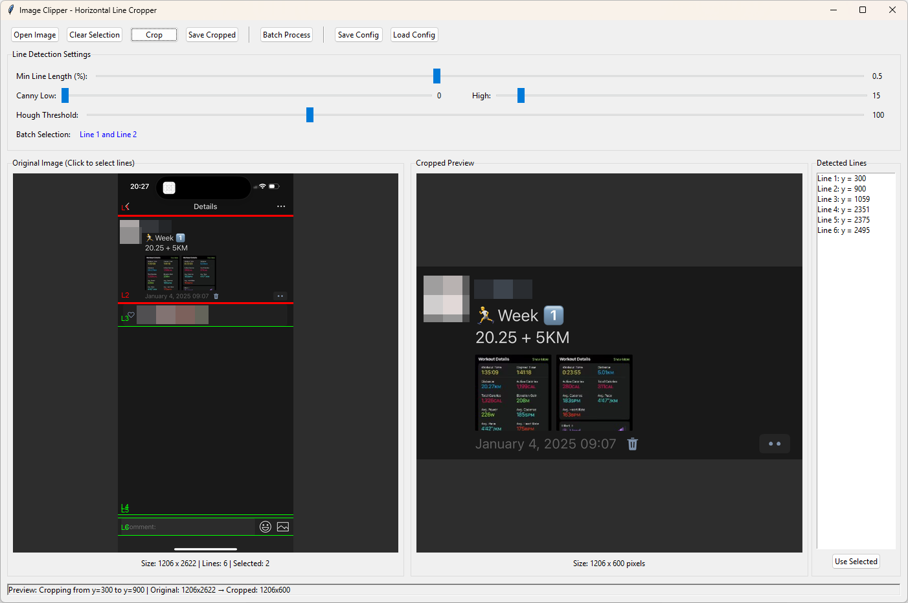
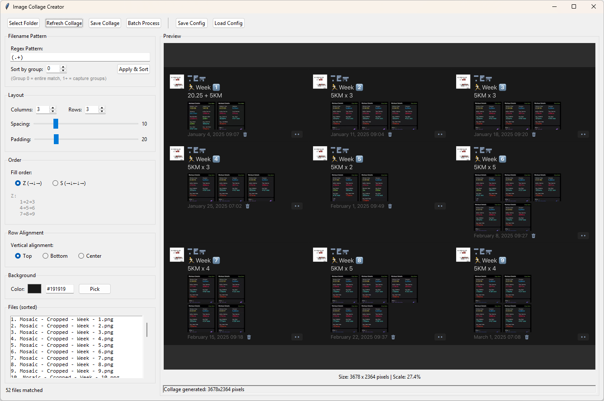
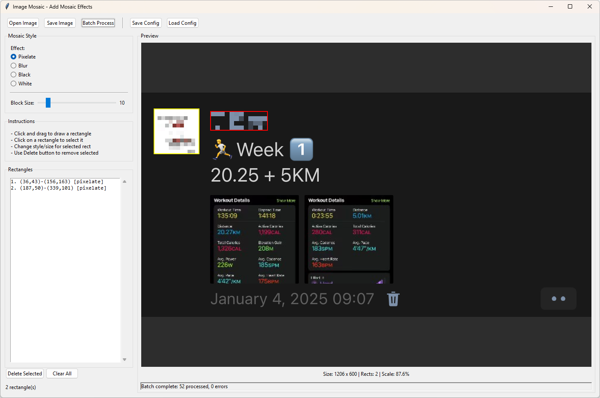

# Moments Tools

A collection of Python GUI tools for **Moments Screenshot** image processing, designed for batch operations with live preview and configuration management.

## Tools Included

- **Image Clipper** - Crop images using horizontal line detection
- **Image Collage** - Create collages from multiple images with customizable layouts
- **Image Mosaic** - Add mosaic/blur effects to specific regions of images

## Requirements

- Python 3.11
- Dependencies:
  ```
  pip install pillow opencv-python numpy
  ```

## Image Clipper

Crop images by detecting horizontal lines and selecting two lines to define the crop region. Useful for extracting content from screenshots or scanned documents.



### Features

- **OpenCV Line Detection**: Uses Canny edge detection and Hough Line Transform
- **Real-time Preview**: Parameters update the preview instantly with debouncing
- **Interactive Selection**: Click to select lines, preview shows crop region
- **Adaptive Batch Processing**: Line numbers (not y-values) are used for batch processing, so Line 1 and Line 2 will be selected for each image even if they have different positions
- **Regex Naming**: Transform output filenames using regex patterns
- **Config Save/Load**: Save all parameters to JSON for reuse

### Usage

```bash
python image_clipper.py
```

1. Open an image
2. Adjust detection parameters (Canny thresholds, Hough threshold, min line length)
3. Click two horizontal lines to select the crop region
4. Save the cropped image or use Batch Process for multiple images

### Parameters

| Parameter         | Description                                           |
| ----------------- | ----------------------------------------------------- |
| Min Line Length   | Minimum line length as ratio of image width (0.0-1.0) |
| Canny Threshold 1 | Lower threshold for Canny edge detection              |
| Canny Threshold 2 | Upper threshold for Canny edge detection              |
| Hough Threshold   | Accumulator threshold for Hough Line Transform        |

---

## Image Collage

Create collages from multiple images with configurable grid layout, alignment, and ordering.



### Features

- **Flexible Layout**: Configure rows and columns (e.g., 3x3, 4x2)
- **Multiple Alignments**: Top, bottom, or center alignment for rows with varying image heights
- **Order Modes**: Z-order (left-to-right, top-to-bottom) or S-order (snake/boustrophedon)
- **Background Color**: Customizable background with color picker
- **Regex Sorting**: Sort input files using regex pattern matching with natural sorting
- **Auto Preview**: Collage updates automatically when settings change
- **Batch Processing**: Create multiple collages from large image sets (e.g., 27 images with 3x3 layout = 3 collages)

### Usage

```bash
python image_collage.py
```

1. Select a folder containing images
2. Configure the regex pattern for sorting (optional)
3. Set layout (rows x columns), spacing, and padding
4. Choose alignment and fill order
5. Save single collage or use Batch Process for multiple collages

### Parameters

| Parameter    | Description                                            |
| ------------ | ------------------------------------------------------ |
| Columns/Rows | Grid dimensions for the collage                        |
| Spacing      | Gap between images in pixels                           |
| Padding      | Border around the entire collage                       |
| Alignment    | Vertical alignment within each row (top/center/bottom) |
| Order        | Fill order: Z (normal) or S (snake)                    |
| Sort Group   | Which regex capture group to use for sorting           |

---

## Image Mosaic

Add mosaic, blur, or solid color effects to specific rectangular regions. Useful for censoring or anonymizing parts of images.



### Features

- **Multiple Effects**: Pixelate, Gaussian blur, solid black, or solid white
- **Draw Rectangles**: Click and drag to create mosaic regions
- **Multiple Regions**: Each rectangle can have a different effect and intensity
- **Live Preview**: See effects applied in real-time
- **Rectangle Management**: Select, edit, delete individual rectangles
- **Absolute Positioning**: Rectangles use fixed pixel coordinates for batch processing
- **Out-of-Bounds Handling**: Rectangles outside image bounds are skipped or clamped with warnings

### Usage

```bash
python image_mosaic.py
```

1. Open an image
2. Select the mosaic style and block size
3. Click and drag to draw rectangles on areas to censor
4. Click existing rectangles to select and modify them
5. Save the image or use Batch Process for multiple images

### Mosaic Styles

| Style    | Description                                             |
| -------- | ------------------------------------------------------- |
| Pixelate | Classic mosaic effect, reduces resolution in the region |
| Blur     | Gaussian blur with configurable radius                  |
| Black    | Solid black fill                                        |
| White    | Solid white fill                                        |

---

## Common Features

All tools share these common capabilities:

### Configuration Files

Each tool saves its configuration to a JSON file:
- `image_clipper_config.json`
- `image_collage_config.json`
- `image_mosaic_config.json`

Configurations are automatically loaded on startup if the file exists.

### Regex Naming

The naming dialog allows transforming input filenames to output filenames using regex:

| Pattern     | Replacement    | Input          | Output                   |
| ----------- | -------------- | -------------- | ------------------------ |
| `(.+)`      | `\1_cropped`   | `photo.png`    | `photo_cropped.png`      |
| `(.+)`      | `Cropped - \1` | `Week - 1.png` | `Cropped - Week - 1.png` |
| `IMG_(\d+)` | `photo_\1`     | `IMG_001.jpg`  | `photo_001.jpg`          |

### Batch Processing

All tools support batch processing:
1. Select input folder
2. Select output folder
3. Configure naming pattern
4. Review and confirm
5. Process all images with progress feedback

### Keyboard Shortcuts

- Standard tkinter shortcuts apply (Tab to navigate, Enter to confirm, Escape to cancel dialogs)

## File Structure

```
moments-tools/
├── image_clipper.py          # Line-based image cropper
├── image_collage.py          # Image collage creator
├── image_mosaic.py           # Mosaic/blur effect tool
├── image_clipper_config.json # Clipper configuration
├── image_collage_config.json # Collage configuration
├── image_mosaic_config.json  # Mosaic configuration
├── docs/
│   ├── Clipper.png          # Clipper screenshot
│   ├── Collage.png          # Collage screenshot
│   └── Mosaic.png           # Mosaic screenshot
└── README.md
```

## License

MIT License
